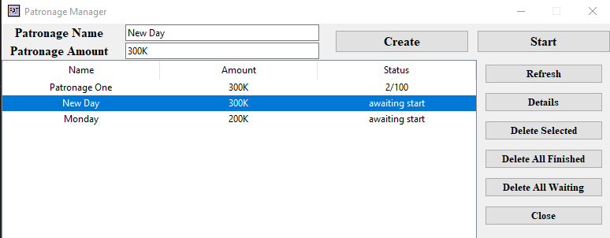
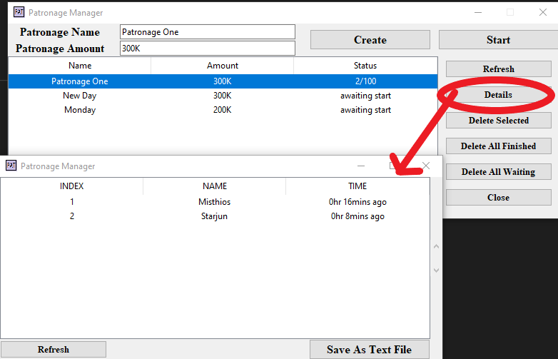
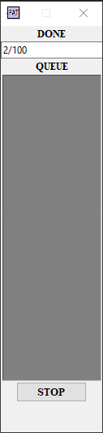

# Patronage Management App
 Patronage Manager App is basically chat bot and data management put together. It manages [patronage event](#general-information).
- Run PatManager.py to start the App
- Demo video [here](https://youtu.be/Ou5LJWAjDvM)

## Table of Contents
* [General Info](#general-information)
* [Technologies Used](#technologies-used)
* [Features](#features)
* [Screenshots](#screenshots)
* [Setup](#setup)

## General Information
- What is Patronage Event?
Patronage Event is like a mini-game which can be played by group of 100 people. When a person buys patronage gift other 99 people receive it. So when all 100 people buy gift then everybody will get 99 gifts though each person bought only one gift. Group has a common group chat and one person acts as a manager who manages queue of people who waiting for there turn to buy gift and maintains record of who bought and who's left to buy.

- Here comes need of Patronage Management App
This App listens to group chat if anyone ready to buy gift and then forms a queue of those people. Now it asks each of them one by one to buy gift. It records there time of gift purchase and maintains a table of those who bought gift. It also replies to Query Commands such as '#status'-how many people bought till now,'#amount'-cost of each gift, '#isdone-name'- checks whether the name mentioned has bought gift or not.

## Technologies Used
- Text Recognition - Tesseract OCR
- OpenCv - Image processing
- tKinter - for GUI
- Sqlite3 - for database
- Multiprocessing

## Features
- Create Patronage Event by Entering Name and Amount
- Real Time Monitering of Queue
- Tabular List representation of all data
- Select and View Details of any Patronage
- Export Patronage Table as Text File
- Resume Patronage without loosing any data
- Ask Query for any general information (status, amount, isdone explained [here](#general-information))

## Screenshots

## Setup
- This App supports 1920x1080 resolution.
- Make sure Scale & layout is 100% under display settings of your computer.
- Use Steam Version for March of Empire game(for patronage event)
- INSTALL Pytesserect OCR before starting Patronage Manager App. Pytesserect OCR : https://github.com/UB-Mannheim/tesseract/wiki from Windows installation section, choose 64bit or 32bit version as per your computer. Install with all default options. installation directory should be : "C:\Program Files\Tesseract-OCR\"
- [Executable version for windows](./dist) Download all parts of zip files and Extract. Run PatronageManager.exe
- Contact Me: abhikukus@gmail.com 
